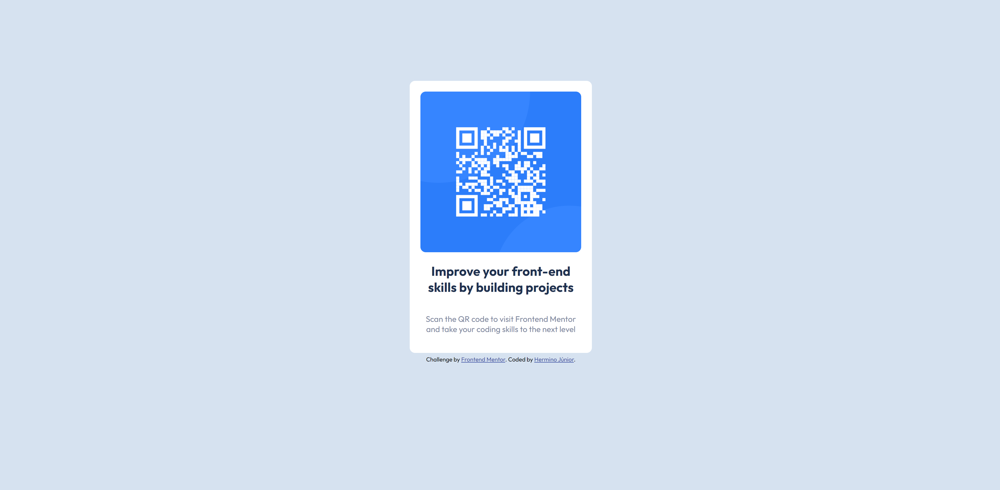

# Frontend Mentor - QR code component solution

This is a solution to the [QR code component challenge on Frontend Mentor](https://www.frontendmentor.io/challenges/qr-code-component-iux_sIO_H). Frontend Mentor challenges help you improve your coding skills by building realistic projects. 

## Table of contents

- [Overview](#overview)
  - [Screenshot](#screenshot)
  - [Links](#links)
- [My process](#my-process)
  - [Built with](#built-with)
  - [What I learned](#what-i-learned)
- [Author](#author)

## Overview

### Screenshot

### Links

- Solution URL: [Solution URL here](https://github.com/hermino/qr_code_component)
- Live Site URL: [Live site URL here](https://hermino.github.io/qr_code_component/index.html)

## My process

The process was very simple, first I thought about the html structure, how I would fit every detail. In my mind I imagine I'm putting together a puzzle. Then just organize with css and then give colors and sizes.

### Built with

- Semantic HTML5 markup
- Flexbox

### What I learned

It's been a while since I developed on the frontend, but it's always good to remember some things about flexbox, it's a real hand on the wheel :)

## Author

- Github - [Hermino Barbosa de Freitas Júnior](https://github.com/hermino)
- Frontend Mentor - [@hermino](https://www.frontendmentor.io/profile/yourusername)
